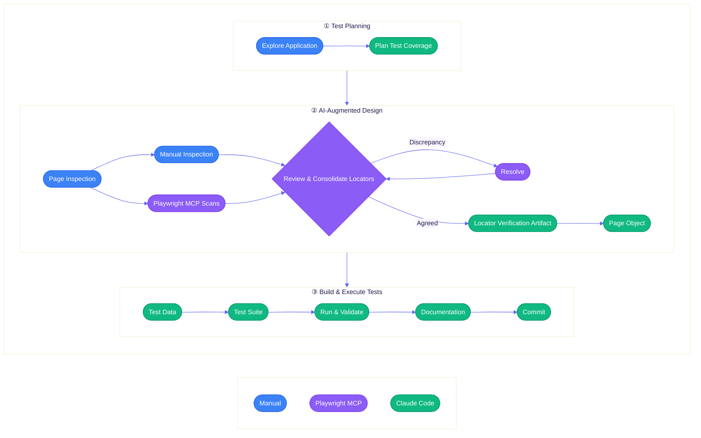

# AI-Augmented Test Automation — Full Workflow

```mermaid
%%{init: {'theme': 'base', 'themeVariables': {'primaryColor': '#e0e7ff', 'primaryBorderColor': '#6366f1', 'primaryTextColor': '#1e1b4b', 'lineColor': '#6366f1', 'fontSize': '14px', 'background': '#faf5ff', 'mainBkg': '#faf5ff', 'clusterBkg': '#ffffff', 'titleColor': '#1e1b4b', 'edgeLabelBackground': '#faf5ff'}}}%%
flowchart TB
    subgraph main [" "]
        direction TB
        subgraph row1 ["① Test Planning"]
            direction LR
            B([Explore Application]) --> C([Plan Test Coverage])
        end

        subgraph row2 ["② AI-Augmented Design"]
            direction LR
            PI([Page Inspection]) --> E([Manual Inspection]) & F([Playwright MCP Scans])
            E & F --> G{Review & Consolidate Locators}
            G -- Discrepancy --> H([Resolve]) --> G
            G -- Agreed --> I([Locator Verification Artifact]) --> J([Page Object])
        end

        subgraph row3 ["③ Build & Execute Tests"]
            direction LR
            K([Test Data]) --> L([Test Suite]) --> M([Run & Validate]) --> N([Documentation]) --> O([Commit])
        end

        row1 --> row2 --> row3
    end

    subgraph legend [" "]
        direction TB
        L1([Manual])
        L2([Playwright MCP])
        L3([Claude Code])
    end

    main ~~~ legend

    style L1 fill:#3b82f6,stroke:#2563eb,color:#fff
    style L2 fill:#8b5cf6,stroke:#7c3aed,color:#fff
    style L3 fill:#10b981,stroke:#059669,color:#fff

    style B fill:#3b82f6,stroke:#2563eb,color:#fff
    style C fill:#10b981,stroke:#059669,color:#fff
    style PI fill:#3b82f6,stroke:#2563eb,color:#fff
    style E fill:#3b82f6,stroke:#2563eb,color:#fff
    style F fill:#8b5cf6,stroke:#7c3aed,color:#fff
    style G fill:#8b5cf6,stroke:#7c3aed,color:#fff
    style H fill:#8b5cf6,stroke:#7c3aed,color:#fff
    style I fill:#10b981,stroke:#059669,color:#fff
    style J fill:#10b981,stroke:#059669,color:#fff
    style K fill:#10b981,stroke:#059669,color:#fff
    style L fill:#10b981,stroke:#059669,color:#fff
    style M fill:#10b981,stroke:#059669,color:#fff
    style N fill:#10b981,stroke:#059669,color:#fff
    style O fill:#10b981,stroke:#059669,color:#fff
```
